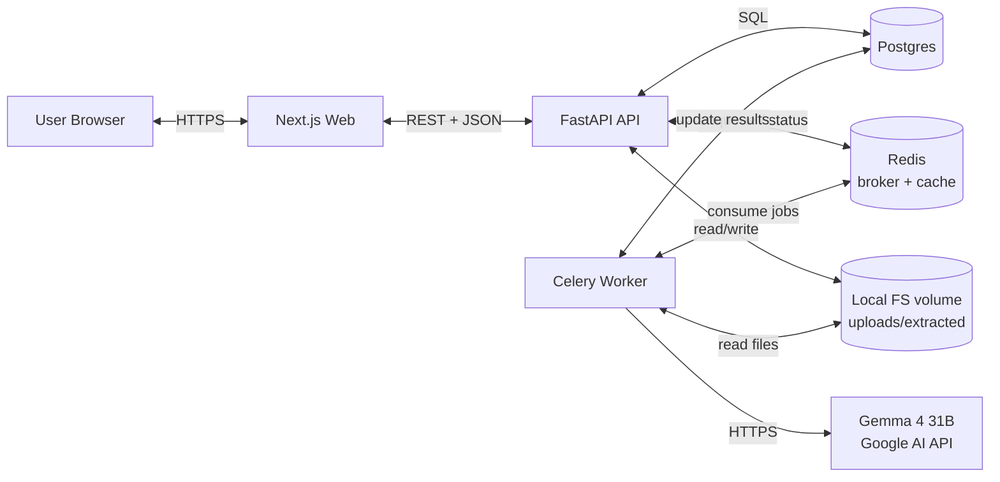

# Architecture

## 1. High-level

CodeScan is a three-tier app with a background worker tier added because LLM scans are slow and need retries / progress.



### Component responsibilities

| Service     | Responsibility                                                                                  |
| ----------- | ----------------------------------------------------------------------------------------------- |
| **web**     | Auth UI, upload UX, file-tree selection, scan config, results browsing. No business logic.      |
| **api**     | HTTP boundary. Validates, persists, authorizes, enqueues. Builds the directory tree.            |
| **worker**  | Runs scans. Orchestrates Gemma calls. Writes findings. Updates progress.                        |
| **postgres**| Source of truth for users, uploads, file inventories, scans, findings.                          |
| **redis**   | Celery broker + result backend. Also small caches (user session lookups if we add them).        |
| **filesystem volume** | Holds uploaded zips and extracted trees. Mounted into both api and worker.            |

---

## 2. Data flow — happy path

1. User logs in via web → web calls `POST /auth/login` → API returns JWT in httpOnly cookie.
2. User uploads a zip → web sends multipart `POST /uploads` → API stores raw zip on disk, creates `uploads` row with status `received`.
3. API enqueues a `prepare_upload` task → worker extracts zip into `/data/extracts/<upload_id>/`, walks the tree, writes a `files` row per file with `is_excluded_by_default` decided here, sets `uploads.status = ready`.
4. Web polls `GET /uploads/{id}` → renders tree once ready.
5. User selects files + scan types + (optionally) keyword list → `POST /scans`.
6. API creates `scans` row (`status=pending`), `scan_files` rows (one per selected file × scan type), enqueues `run_scan(scan_id)`.
7. Worker fans out per-file Gemma calls (with bounded concurrency), writes `scan_findings` as it goes, updates `scans.progress` after each file.
8. Web polls `GET /scans/{id}` for progress and `GET /scans/{id}/findings` for incremental results.
9. On completion, `scans.status=completed`. User exports via `GET /scans/{id}/export?fmt=json|csv`.

---

## 3. Why these choices

- **FastAPI over Flask/Django:** native async, Pydantic v2 validation, automatic OpenAPI, fast.
- **Celery over RQ / arq / FastAPI BackgroundTasks:** scans are minutes-long, need retries, parallel fanout, observable. BackgroundTasks dies with the process.
- **Postgres over SQLite / Mongo:** relational fits scan/finding shape; JSONB for flexible LLM metadata; production-grade.
- **Next.js over plain Vite/React:** routing, layouts, server components for auth-gated pages, easy auth cookie handling. If team prefers SPA-only, swap for Vite — see `CONTRIBUTING.md`.
- **shadcn/ui over Material/Chakra:** copy-in primitives, no runtime theme leak, full control over visual identity.
- **Gemma 4 31B over a hosted closed model:** user-specified. Note: Gemma 4 31B is open-weight under Apache 2.0; we use Google AI Studio's hosted endpoint for v1 but can swap to self-hosted (Vertex AI / Cloud Run / on-prem vLLM) without API changes — the LLM client is a single module.

---

## 4. Concurrency model

- **API:** uvicorn with `--workers N`. All endpoints are `async def`. DB calls via async SQLAlchemy. No blocking I/O on the request thread.
- **Worker:** Celery prefork pool, `--concurrency=4` per worker process by default. Each scan task internally fans out file scans using a bounded `asyncio.Semaphore` (or thread pool) capped at `LLM_PARALLELISM` (default 4).
- **Gemma rate limiting:** token-bucket in worker (configurable RPS + concurrent in-flight cap). Backoff on 429 with jitter.

---

## 5. Storage layout

```
/data/
├── uploads/                # raw uploads
│   └── <upload_id>.zip
└── extracts/               # extracted trees
    └── <upload_id>/
        └── <original folder structure>
```

- Path is namespaced by `upload_id` (UUID) — never user-derived names — to neutralize path traversal.
- Volume mounted RW into `api` (writes uploads, extracts) and `worker` (reads files for scanning).
- Cleanup: a periodic Celery beat task deletes extracts older than `RETENTION_DAYS` (default 30; **TODO confirm**).

---

## 6. Scaling notes (out of v1, but worth designing for)

- Replace local FS with S3 / GCS object store; uploads via signed URLs.
- Replace Postgres with managed (RDS/Cloud SQL); enable PITR.
- Move Redis to managed (ElastiCache / Memorystore).
- Add a read replica for findings queries if scans get huge.
- Move Gemma to self-hosted vLLM behind an internal endpoint for cost control.
- Add multi-tenancy (orgs, RBAC) — schema already has `user_id` on every owned row, so adding `org_id` is additive.

---

## 7. What is NOT in v1 (explicit non-goals)

- Password reset / email verification flows
- OAuth / SSO
- Org / team accounts
- Streaming results via SSE/WebSocket (polling is fine for v1)
- SARIF export (v1.1)
- IDE plugin
- Self-hosted Gemma
- Admin dashboard
