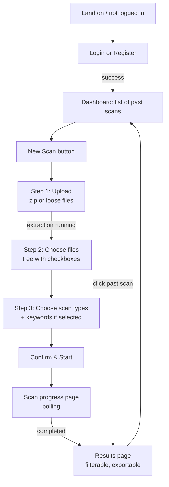
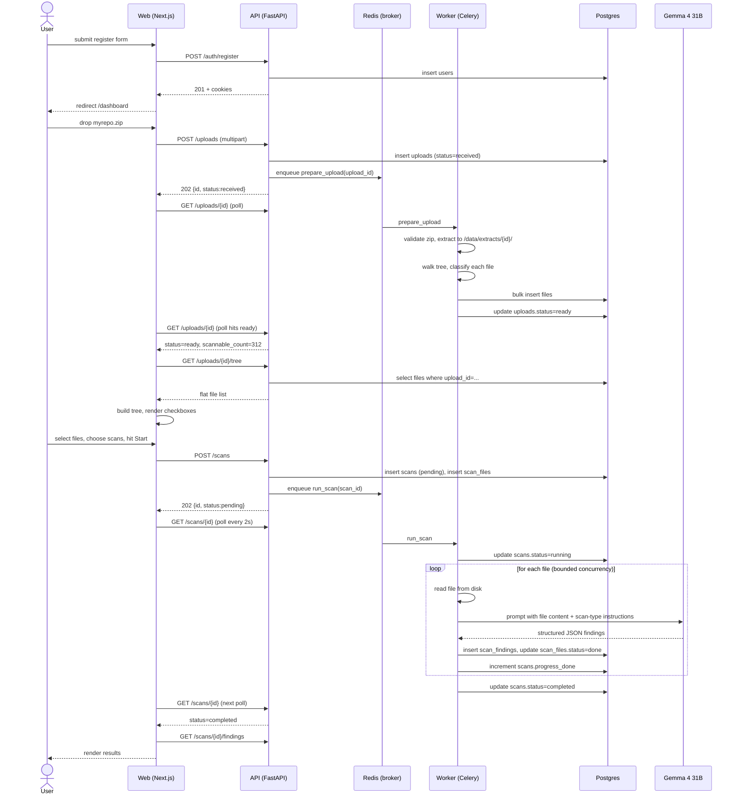

# Flow

## Top-level user journey



The new-scan wizard is broken into four explicit steps; users can navigate back without losing state until they hit "Start scan."

---

## Sequence: register → upload → scan → results



---

## State transitions

### Upload
```
received ──prepare_upload──▶ extracting ──tree built──▶ ready
                                       ╲────error────▶ failed
```

### Scan
```
pending ──worker picks up──▶ running ──all files done──▶ completed
                                    ╲──fatal error────▶ failed
                                    ╲──user cancels───▶ cancelled
                                    ╲──user pauses───▶ paused ──user resumes──▶ pending
                                                              ╲──user cancels─▶ cancelled
```

Pause is a soft-stop. The worker checks a pause flag between files and exits cleanly; the in-flight file finishes and persists findings before exit, so paused scans never leave `running` `scan_files` rows behind. Resume re-enqueues the scan task; the worker picks up the unprocessed `scan_files.status = 'pending'` rows and continues. Findings persisted before the pause remain visible via `GET /scans/{id}/findings` throughout.

### Dispatch concurrency invariant

**Exactly one `_dispatch` (worker run) is active per `scan_id` at any time.**

Enforced by a Postgres advisory lock keyed on the scan id (`pg_try_advisory_lock(hashtext('scan:' || scan_id))`), acquired at the top of `_dispatch` and released on every exit path (completion, pause, cancel, exception). A second `run_scan(scan_id)` task that picks up while the first holds the lock must **Celery-retry with exponential backoff** (2s, 4s, 8s, 16s, 32s — five attempts, matching the Gemma-5xx retry policy in `SCAN_RULES.md` §"Retry logic"). After the retry budget is exhausted the task marks the scan `failed` with `error="dispatch_lock_timeout"`. The retry path uses Celery's `self.retry(countdown=...)` — non-blocking, the worker slot is freed between attempts.

Why this matters: pause is a DB flag the API sets *before* the old worker observes it. The worker's between-files poll has a window of up to `cancel_check_interval_files` completions plus the in-flight drain. A user who clicks Pause then Resume during that window causes the API to enqueue a new `run_scan` task while the old one is still draining. Without the lock, both `_dispatch` loops process overlapping `scan_files` rows (anything not yet marked `done`), which:

- Bumps `scan.progress_done` twice for files processed by both runs, producing `progress_done > progress_total`.
- Inserts duplicate `scan_findings` rows because `_persist_outcome` is not idempotent.

The advisory lock is a **fence with retry**: the second worker can't bulldoze through, but it also doesn't drop the task — Celery retries it until the lock is free, so the resume always eventually runs.

The same lock also fences against Celery re-delivery during a normal long-running scan (visibility timeout), which the previous "allow re-entry from running" path handled loosely.

### Per-file scan
```
pending ──picked──▶ running ──ok──▶ done
                          ╲─error─▶ failed (retried up to N times, then surfaced)
                          ╲──skip──▶ skipped (e.g. detected as binary on second look)
```

---

## Failure & retry behavior

| Failure                         | Behavior                                                                 |
| ------------------------------- | ------------------------------------------------------------------------ |
| Zip extraction fails            | `uploads.status=failed`, `error` populated. User sees inline error.      |
| Single Gemma call 5xx           | Celery retry with exp backoff (3 attempts).                              |
| Single Gemma call 429           | Token-bucket pauses; retry after `Retry-After`.                          |
| Single Gemma call returns invalid JSON | One repair attempt with stricter prompt. If still bad: `scan_files.status=failed`, scan continues for other files. |
| Scan gets > 10% file failures   | `scans.status=failed` with summary error.                                |
| Worker process dies mid-scan    | Celery task ack-late + visibility timeout: another worker picks it up; on lock acquisition, per-file `status=running` rows older than `STUCK_THRESHOLD` are reset to `pending` (orphan recovery). |
| User pauses scan                | Worker exits cleanly between files; in-flight file completes and persists findings; unprocessed rows remain `pending`. Findings already persisted stay visible. |
| Worker dies while scan paused   | Pause is a DB flag — no worker process is needed to "hold" it. The scan stays `paused` and resume works as normal once a worker is available. |
| User resumes after pause        | Re-enqueue `run_scan(scan_id)`. New worker waits for the dispatch advisory lock; old worker releases it on exit; new worker then selects `scan_files.status='pending'` and continues. Progress counters resume from the saved `progress_done`. |
| User pauses then immediately resumes | API enqueues a new `run_scan` while the old worker is still draining its in-flight files. Old worker holds the dispatch advisory lock; new worker tries `pg_try_advisory_lock`, fails, and Celery-retries with exponential backoff (2s/4s/8s/16s/32s). Once the old worker releases the lock, the next retry acquires it and continues. No over-counting, no duplicate findings. |
| Celery re-delivers a still-running task | Same fence as above: second delivery's `_dispatch` cannot acquire the lock and Celery-retries. The first delivery owns the run; the redelivery either acquires the lock once the first finishes or eventually fails with `dispatch_lock_timeout` after the retry budget. |

---

## What the user sees during a scan

The progress page shows:

- A determinate progress bar: `progress_done / progress_total`.
- A live count of findings by severity.
- A "recently scanned" list (last 10 files) with status badge.
- A "Cancel" button.
- An ETA computed from rolling average of last 10 file latencies.

Polling cadence: 2s while `running`, 5s while `pending`. Switches to no-poll once `completed` / `failed` / `cancelled`.
