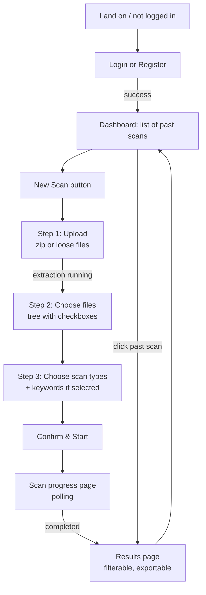

# Flow

## Top-level user journey



The new-scan wizard is broken into four explicit steps; users can navigate back without losing state until they hit "Start scan."

---

## Sequence: register → upload → scan → results

```mermaid
sequenceDiagram
    actor U as User
    participant W as Web (Next.js)
    participant A as API (FastAPI)
    participant R as Redis (broker)
    participant Q as Worker (Celery)
    participant P as Postgres
    participant G as Gemma 4 31B

    U->>W: submit register form
    W->>A: POST /auth/register
    A->>P: insert users
    A-->>W: 201 + cookies
    W-->>U: redirect /dashboard

    U->>W: drop myrepo.zip
    W->>A: POST /uploads (multipart)
    A->>P: insert uploads (status=received)
    A->>R: enqueue prepare_upload(upload_id)
    A-->>W: 202 {id, status:received}
    W->>A: GET /uploads/{id}  (poll)

    R->>Q: prepare_upload
    Q->>Q: validate zip, extract to /data/extracts/{id}/
    Q->>Q: walk tree, classify each file
    Q->>P: bulk insert files
    Q->>P: update uploads.status=ready

    W->>A: GET /uploads/{id}  (poll hits ready)
    A-->>W: status=ready, scannable_count=312
    W->>A: GET /uploads/{id}/tree
    A->>P: select files where upload_id=...
    A-->>W: flat file list
    W->>W: build tree, render checkboxes

    U->>W: select files, choose scans, hit Start
    W->>A: POST /scans
    A->>P: insert scans (pending), insert scan_files
    A->>R: enqueue run_scan(scan_id)
    A-->>W: 202 {id, status:pending}

    W->>A: GET /scans/{id}  (poll every 2s)

    R->>Q: run_scan
    Q->>P: update scans.status=running
    loop for each file (bounded concurrency)
        Q->>Q: read file from disk
        Q->>G: prompt with file content + scan-type instructions
        G-->>Q: structured JSON findings
        Q->>P: insert scan_findings, update scan_files.status=done
        Q->>P: increment scans.progress_done
    end
    Q->>P: update scans.status=completed

    W->>A: GET /scans/{id}  (next poll)
    A-->>W: status=completed
    W->>A: GET /scans/{id}/findings
    W-->>U: render results
```



---

## State transitions

### Upload
```
received ──prepare_upload──▶ extracting ──tree built──▶ ready
                                       ╲────error────▶ failed
```

### Scan
```
pending ──worker picks up──▶ running ──all files done──▶ completed
                                    ╲──fatal error────▶ failed
                                    ╲──user cancels───▶ cancelled
```

### Per-file scan
```
pending ──picked──▶ running ──ok──▶ done
                          ╲─error─▶ failed (retried up to N times, then surfaced)
                          ╲──skip──▶ skipped (e.g. detected as binary on second look)
```

---

## Failure & retry behavior

| Failure                         | Behavior                                                                 |
| ------------------------------- | ------------------------------------------------------------------------ |
| Zip extraction fails            | `uploads.status=failed`, `error` populated. User sees inline error.      |
| Single Gemma call 5xx           | Celery retry with exp backoff (3 attempts).                              |
| Single Gemma call 429           | Token-bucket pauses; retry after `Retry-After`.                          |
| Single Gemma call returns invalid JSON | One repair attempt with stricter prompt. If still bad: `scan_files.status=failed`, scan continues for other files. |
| Scan gets > 10% file failures   | `scans.status=failed` with summary error.                                |
| Worker process dies mid-scan    | Celery task ack-late + visibility timeout: another worker picks it up; per-file `status=running` rows older than `STUCK_THRESHOLD` are reset to `pending`. |

---

## What the user sees during a scan

The progress page shows:

- A determinate progress bar: `progress_done / progress_total`.
- A live count of findings by severity.
- A "recently scanned" list (last 10 files) with status badge.
- A "Cancel" button.
- An ETA computed from rolling average of last 10 file latencies.

Polling cadence: 2s while `running`, 5s while `pending`. Switches to no-poll once `completed` / `failed` / `cancelled`.
