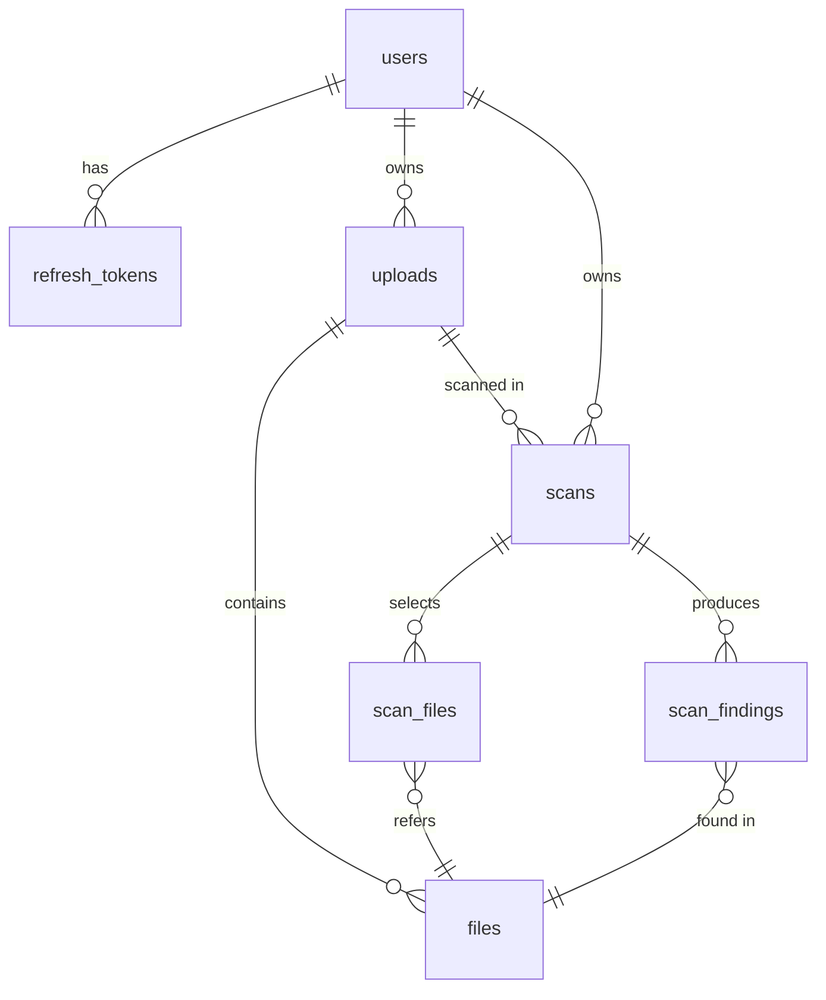

# Database Schema

Postgres 16. Migrations via Alembic. All `id` columns are UUIDv7 (time-ordered) generated in the application layer.

> **Convention:** every "owned" table carries `user_id` and is filtered by it on every read. This is enforced in a base repository class — never write a query without it.

---

## ER diagram



---

## Tables

### `users`

| Column          | Type           | Notes                                |
| --------------- | -------------- | ------------------------------------ |
| `id`            | UUID PK        |                                      |
| `email`         | CITEXT UNIQUE  | normalized lowercase, citext-indexed |
| `password_hash` | TEXT NOT NULL  | bcrypt, cost 12                      |
| `is_active`     | BOOL DEFAULT TRUE |                                   |
| `created_at`    | TIMESTAMPTZ DEFAULT now() |                          |
| `updated_at`    | TIMESTAMPTZ DEFAULT now() |                          |

Indexes: `UNIQUE(email)`.

### `refresh_tokens`

| Column        | Type        | Notes                                          |
| ------------- | ----------- | ---------------------------------------------- |
| `id`          | UUID PK     |                                                |
| `user_id`     | UUID FK     | → `users(id)` ON DELETE CASCADE                |
| `family_id`   | UUID NULL   | logical refresh-token family for replay revocation |
| `token_hash`  | TEXT UNIQUE | SHA-256 of refresh JWT — never store raw       |
| `expires_at`  | TIMESTAMPTZ |                                                |
| `revoked_at`  | TIMESTAMPTZ NULL | non-null = revoked                        |
| `created_at`  | TIMESTAMPTZ DEFAULT now() |                                  |
| `user_agent`  | TEXT NULL   |                                                |
| `ip`          | INET NULL   |                                                |

Indexes: `(user_id)`, `UNIQUE(token_hash)`, `(user_id, family_id)`.

Tokens created before T1.2 may have `NULL family_id` and are treated as their own family of one.

### `uploads`

| Column            | Type        | Notes                                                                       |
| ----------------- | ----------- | --------------------------------------------------------------------------- |
| `id`              | UUID PK     |                                                                             |
| `user_id`         | UUID FK     | → `users(id)` ON DELETE CASCADE                                             |
| `original_name`   | TEXT        | filename as uploaded                                                        |
| `kind`            | TEXT        | `zip` \| `loose`                                                            |
| `size_bytes`      | BIGINT      | original archive size or sum of loose files                                 |
| `storage_path`    | TEXT        | server path to the raw artifact                                             |
| `extract_path`    | TEXT NULL   | populated after extraction                                                  |
| `status`          | TEXT        | `received` \| `extracting` \| `ready` \| `failed`                          |
| `error`           | TEXT NULL   | populated on `failed`                                                       |
| `file_count`      | INT         | total files in tree                                                         |
| `scannable_count` | INT         | files not excluded by default                                               |
| `created_at`      | TIMESTAMPTZ DEFAULT now() |                                                |
| `updated_at`      | TIMESTAMPTZ DEFAULT now() |                                                |

Indexes: `(user_id, created_at DESC)`.

### `files`

| Column           | Type        | Notes                                                  |
| ---------------- | ----------- | ------------------------------------------------------ |
| `id`             | UUID PK     |                                                        |
| `upload_id`      | UUID FK     | → `uploads(id)` ON DELETE CASCADE                      |
| `path`           | TEXT        | path relative to extract root, forward-slash normalized|
| `name`           | TEXT        | basename                                               |
| `parent_path`    | TEXT        | dirname (empty for root files)                         |
| `size_bytes`     | BIGINT      |                                                        |
| `language`       | TEXT NULL   | detected; e.g. `python`, `typescript`, `go`            |
| `is_binary`      | BOOL        |                                                        |
| `is_excluded_by_default` | BOOL |                                                       |
| `excluded_reason`| TEXT NULL   | enum-ish: `binary`, `lockfile`, `vendor_dir`, `oversize`, `dotfile`, `build_artifact`, `image`, `unknown_ext` |
| `sha256`         | TEXT        | hex digest, used for cache + dedup                     |

Indexes: `(upload_id, path)`, `(upload_id, parent_path)`. UNIQUE `(upload_id, path)`.

> The full directory tree is *materialized* in this table. We do not walk the filesystem to build the tree at request time — `GET /uploads/{id}/tree` is a single SQL query.

### `scans`

| Column          | Type          | Notes                                                       |
| --------------- | ------------- | ----------------------------------------------------------- |
| `id`            | UUID PK       |                                                             |
| `user_id`       | UUID FK       | → `users(id)`                                               |
| `upload_id`     | UUID FK       | → `uploads(id)` ON DELETE CASCADE                           |
| `name`          | TEXT          | user-given label, optional                                  |
| `scan_types`    | TEXT[]        | subset of `{security, bugs, keywords}`                      |
| `keywords`      | JSONB         | `{ items: ["TODO", "FIXME"], case_sensitive: false, regex: false }` |
| `status`        | TEXT          | `pending` \| `running` \| `completed` \| `failed` \| `cancelled` |
| `progress_done` | INT           | files completed                                             |
| `progress_total`| INT           | files queued                                                |
| `started_at`    | TIMESTAMPTZ NULL |                                                          |
| `finished_at`   | TIMESTAMPTZ NULL |                                                          |
| `error`         | TEXT NULL     |                                                             |
| `model`         | TEXT          | `gemma-4-31b-it` (logged for reproducibility)               |
| `model_settings`| JSONB         | temperature, top_p, etc.                                    |
| `created_at`    | TIMESTAMPTZ DEFAULT now() |                                                |
| `updated_at`    | TIMESTAMPTZ DEFAULT now() |                                                |

Indexes: `(user_id, created_at DESC)`, `(upload_id)`, `(status)`.

### `scan_files`

Join table: which files are in scope for this scan. Also tracks per-file status so we can resume / retry.

| Column        | Type        | Notes                                                  |
| ------------- | ----------- | ------------------------------------------------------ |
| `id`          | UUID PK     |                                                        |
| `scan_id`     | UUID FK     | → `scans(id)` ON DELETE CASCADE                        |
| `file_id`     | UUID FK     | → `files(id)`                                          |
| `status`      | TEXT        | `pending` \| `running` \| `done` \| `failed` \| `skipped` |
| `error`       | TEXT NULL   |                                                        |
| `tokens_in`   | INT NULL    | reported by Gemma                                      |
| `tokens_out`  | INT NULL    |                                                        |
| `latency_ms`  | INT NULL    |                                                        |
| `started_at`  | TIMESTAMPTZ NULL |                                                   |
| `finished_at` | TIMESTAMPTZ NULL |                                                   |

Indexes: `(scan_id, status)`. UNIQUE `(scan_id, file_id)`.

### `scan_findings`

| Column         | Type        | Notes                                                                              |
| -------------- | ----------- | ---------------------------------------------------------------------------------- |
| `id`           | UUID PK     |                                                                                    |
| `scan_id`      | UUID FK     | → `scans(id)` ON DELETE CASCADE                                                    |
| `file_id`      | UUID FK     | → `files(id)`                                                                      |
| `scan_type`    | TEXT        | `security` \| `bugs` \| `keywords`                                                 |
| `severity`     | TEXT        | `critical` \| `high` \| `medium` \| `low` \| `info`                                |
| `title`        | TEXT        | short summary, ≤ 120 chars                                                         |
| `message`      | TEXT        | full description                                                                   |
| `recommendation`| TEXT NULL  | how to fix                                                                         |
| `line_start`   | INT NULL    | 1-indexed                                                                          |
| `line_end`     | INT NULL    | 1-indexed, inclusive                                                               |
| `snippet`      | TEXT NULL   | the offending lines, ≤ 1000 chars                                                  |
| `rule_id`      | TEXT NULL   | e.g. `CWE-89`, `KW:TODO`, internal id                                              |
| `confidence`   | NUMERIC(3,2) NULL | 0.00–1.00 if model returns one                                               |
| `metadata`     | JSONB       | catch-all for model-specific extras                                                |
| `created_at`   | TIMESTAMPTZ DEFAULT now() |                                                       |

Indexes: `(scan_id, severity)`, `(scan_id, scan_type)`, `(scan_id, file_id)`.

---

## Status state machines

### `uploads.status`
```
received → extracting → ready
                     ↘ failed
```

### `scans.status`
```
pending → running → completed
              ↘ failed
              ↘ cancelled
```

### `scan_files.status`
```
pending → running → done
              ↘ failed
              ↘ skipped     (e.g. file too large after re-check, binary)
```

---

## Sample queries

```sql
-- Tree listing for an upload (tree built client-side from this flat list)
SELECT id, path, parent_path, name, size_bytes, language,
       is_binary, is_excluded_by_default, excluded_reason
FROM files
WHERE upload_id = $1
ORDER BY path;

-- Scan progress
SELECT status, progress_done, progress_total
FROM scans
WHERE id = $1 AND user_id = $2;

-- Findings for a scan, sorted by severity
SELECT f.path, sf.severity, sf.title, sf.line_start, sf.line_end, sf.scan_type
FROM scan_findings sf
JOIN files f ON f.id = sf.file_id
WHERE sf.scan_id = $1
ORDER BY array_position(ARRAY['critical','high','medium','low','info'], sf.severity),
         f.path, sf.line_start;
```

---

## Migration strategy

- Alembic with autogenerate disabled for renames / data migrations — write those by hand.
- Every PR that changes a model includes a migration. Reviewers reject otherwise.
- Migrations are forward-only in production; rollback by writing a new forward migration.
